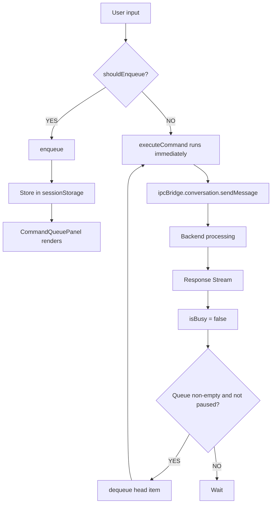
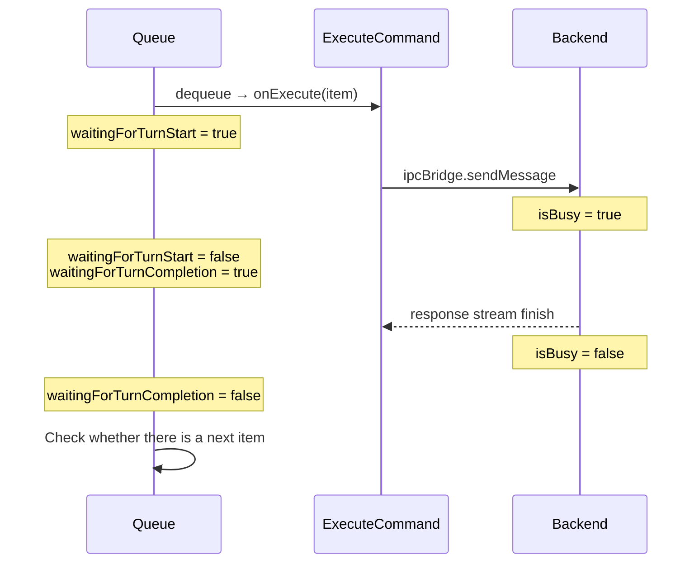
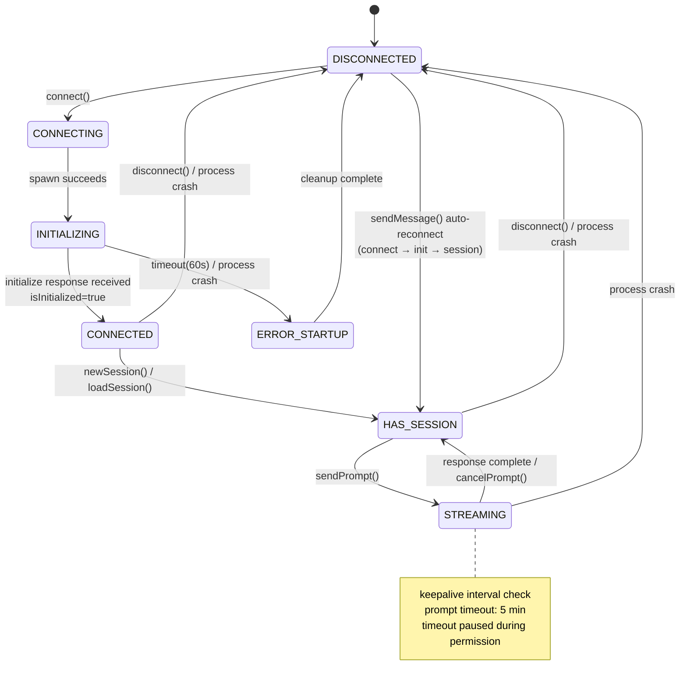
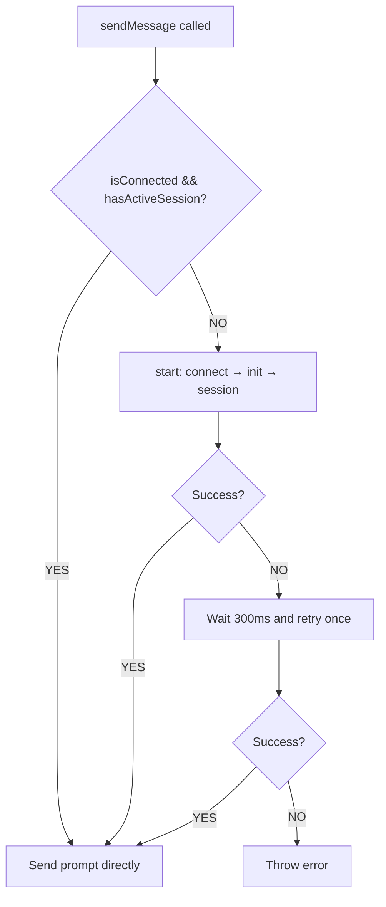
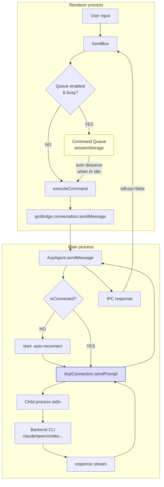

This page covers two mechanisms that together make a conversation feel responsive even while the AI is busy:

- The **Command Queue** lives in the **renderer** and buffers the user's messages on the UI side.
- The **ACP state machine** lives in the **main process** and manages the connection to a backend CLI agent.

They are connected through the IPC bridge — the queue watches the `isBusy` flag to decide when to send the next message.

## 1. Conversation Command Queue

### What it is and what it solves

The Command Queue is a user-controllable command-buffering mechanism. While the AI is processing the previous message, new messages sent by the user are not discarded but instead enter a queue to be executed in order.

**The problem without a queue**: when the user sends a message while the AI is busy, they only see "conversation in progress" and the message is lost.

**Disabled by default**; it must be enabled manually under Settings → System → "Enable Command Queue".

### Core files

| File                                                                       | Responsibility                                                      |
| -------------------------------------------------------------------------- | ------------------------------------------------------------------- |
| `src/renderer/pages/conversation/platforms/useConversationCommandQueue.ts` | Core hook, contains all queue logic                                 |
| `src/renderer/components/chat/CommandQueuePanel.tsx`                        | Queue UI panel, supports edit/drag/delete                           |
| `src/renderer/hooks/mcp/messageQueue.ts`                                    | MCP toast message queue (separate mechanism, not the Command Queue) |

### Data structures and constraints

```typescript
type ConversationCommandQueueItem = {
  id: string; // UUID
  input: string; // command text
  files: string[]; // attachment paths
  createdAt: number; // timestamp
};

type ConversationCommandQueueState = {
  items: ConversationCommandQueueItem[];
  isPaused: boolean; // user can pause automatic execution
};
```

| Constraint               | Value                             |
| ------------------------ | --------------------------------- |
| Max queue length         | 20 items                          |
| Max characters per item  | 20,000                            |
| Max attachments per item | 50                                |
| Max queue storage        | 256 KB                            |
| Persistence              | sessionStorage (per conversation) |

### Enqueue conditions

```typescript
shouldEnqueueConversationCommand({ enabled, isBusy, hasPendingCommands }) = enabled && (isBusy || hasPendingCommands);
```

Both conditions must hold to enqueue:

1. The global toggle is enabled.
2. The AI is busy **or** there are already pending commands in the queue.

### Position in the message pipeline



### Full flow

**Enqueue phase**

1. The user sends a message in the SendBox.
2. `onSendHandler` checks `shouldEnqueueConversationCommand()`.
3. Validate constraints (empty input, length, file count, queue full, total size).
4. Validation fails → `Message.warning()` prompt.
5. Validation passes → create item (UUID + timestamp), append to the queue, persist to sessionStorage.

**Dequeue phase (automatic)**

1. A `useEffect` watches: `[items, isBusy, enabled, isHydrated, isInteractionLocked]`.
2. When all conditions hold:
   - The queue is enabled.
   - The component is hydrated (restoration from storage complete).
   - Not paused.
   - The AI is idle (`isBusy = false`).
   - Not interaction-locked (the user is not editing/dragging).
3. Take the head item → set `waitingForTurnStart = true` → call `onExecute()`.
4. Execution fails → restore the item to the head → automatically pause the queue.

**Turn tracking**



### Cross-platform support

The queue mechanism is integrated through the SendBox; the following platforms all support it:

- Nanobot (`NanobotSendBox.tsx`)
- Gemini (`GeminiSendBox.tsx`)
- ACP (`AcpSendBox.tsx`)
- OpenClaw (`OpenClawSendBox.tsx`)
- Aionrs

## 2. ACP State Management

### Core files

| File                                        | Responsibility               |
| ------------------------------------------- | ---------------------------- |
| `src/process/agent/acp/AcpConnection.ts`    | Core state machine           |
| `src/process/agent/acp/index.ts` (AcpAgent) | Upper-layer Agent wrapper    |
| `src/process/agent/acp/acpConnectors.ts`    | Backend-specific spawn logic |
| `src/common/types/acpTypes.ts`              | Type definitions             |

### State variables

ACP does not use a single enum to represent state; instead it is implicitly determined by **the combination of several independent flags**:

| Variable          | Type                   | Meaning                                    |
| ----------------- | ---------------------- | ------------------------------------------ |
| `child`           | `ChildProcess \| null` | Child process reference                    |
| `sessionId`       | `string \| null`       | Active session ID                          |
| `isInitialized`   | `boolean`              | Whether the protocol handshake is complete |
| `isSetupComplete` | `boolean`              | Whether the startup phase is complete      |
| `backend`         | `AcpBackend \| null`   | Backend type                               |
| `pendingRequests` | `Map`                  | In-flight RPC requests                     |

Derived properties:

```typescript
get isConnected(): boolean {
  return this.child !== null && !this.child.killed;
}
get hasActiveSession(): boolean {
  return this.sessionId !== null;
}
```

### Logical states

| State             | Condition combination                                      | Meaning                            |
| ----------------- | ---------------------------------------------------------- | ---------------------------------- |
| **DISCONNECTED**  | child=null, sessionId=null, isInitialized=false            | No process, no session             |
| **CONNECTING**    | child≠null, isInitialized=false                            | Process starting                   |
| **INITIALIZING**  | child running, initialize request in flight                | Protocol handshake (60s timeout)   |
| **CONNECTED**     | isConnected=true, isInitialized=true, isSetupComplete=true | Ready, waiting to create a session |
| **HAS_SESSION**   | CONNECTED + sessionId≠null                                 | Can send messages                  |
| **STREAMING**     | HAS_SESSION + pendingRequests.size>0                       | Turn in progress                   |
| **ERROR_STARTUP** | child exited, isSetupComplete=false                        | Crashed during startup             |
| **ERROR_RUNTIME** | child exited, isSetupComplete=true                         | Crashed at runtime                 |

### State transition diagram



### Key methods

| Method                        | Responsibility              |
| ----------------------------- | --------------------------- |
| `connect()`                   | Initiate connection         |
| `doConnect()`                 | Dispatch spawn by backend   |
| `setupChildProcessHandlers()` | Set up protocol handlers    |
| `initialize()`                | Send the initialize RPC     |
| `newSession()`                | Create a new session        |
| `loadSession()`               | Restore an existing session |
| `sendPrompt()`                | Send a user message         |
| `handleMessage()`             | Receive responses           |
| `handleProcessExit()`         | Clean up on process exit    |
| `disconnect()`                | User-initiated disconnect   |
| `cancelPrompt()`              | Cancel the current turn     |

### Known stability caveats

These are sharp edges worth knowing when working on `AcpConnection.ts` / `index.ts`:

1. **No concurrent-prompt protection** — `sendPrompt()` has no reentrancy guard. If it is called again before the previous prompt completes, two requests are sent on the same process stdin and protocol-layer behavior is undefined. Today it relies on the UI layer not calling twice in a row.
2. **Permission timeout race** — when a permission request blocks the prompt, the timeout is paused. But if the dialog is left unanswered for a very long time, a spurious timeout may fire after it resumes.
3. **Process-state detection timing** — there is a tiny gap between Node.js's `exit` event and the `exitCode`/`signalCode` properties being set, so keepalive may read a stale state.
4. **Duplicate permission-request overwrite** — if the agent sends two permission requests for the same `toolCallId`, the second overwrites the first's pending entry, losing the first's resolve callback.
5. **Fragile session-ID fallback** — `this.sessionId = response.sessionId || sessionId;` falls back to the passed-in id when the backend returns an undefined `sessionId`, but throws if the response itself is null/undefined.
6. **Setters don't validate connection state** — `setSessionMode()`, `setModel()`, `setConfigOption()` only check whether `sessionId` exists, not whether the process is alive, so they can write to an already-dead process.
7. **Model dual-cache inconsistency** — `setModel()` updates both the `this.models` and `this.configOptions` caches; if one update fails, the two diverge.

### Automatic reconnection

When `sendMessage()` finds `!isConnected || !hasActiveSession`, it automatically calls `start()` to run the full connect → initialize → newSession/loadSession sequence. After the first failure there is one retry with a 300ms delay.



## 3. How the two fit together



The Command Queue lives in the **UI layer of the renderer process** and buffers commands on the user side; the ACP state machine lives in the **main process** and manages the connection and protocol communication with the backend CLI. The two are connected through the IPC bridge, and the queue decides when to dequeue and execute the next command by watching the `isBusy` state.
