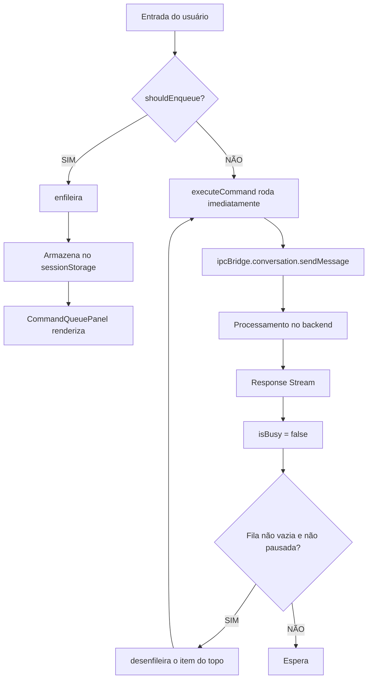
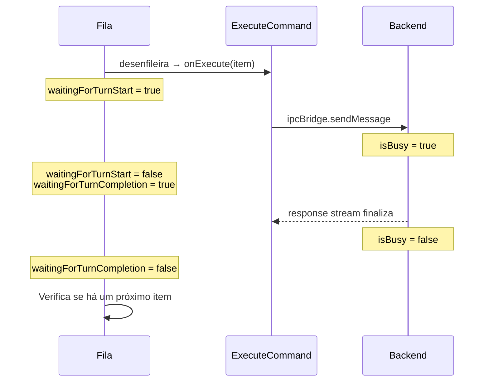
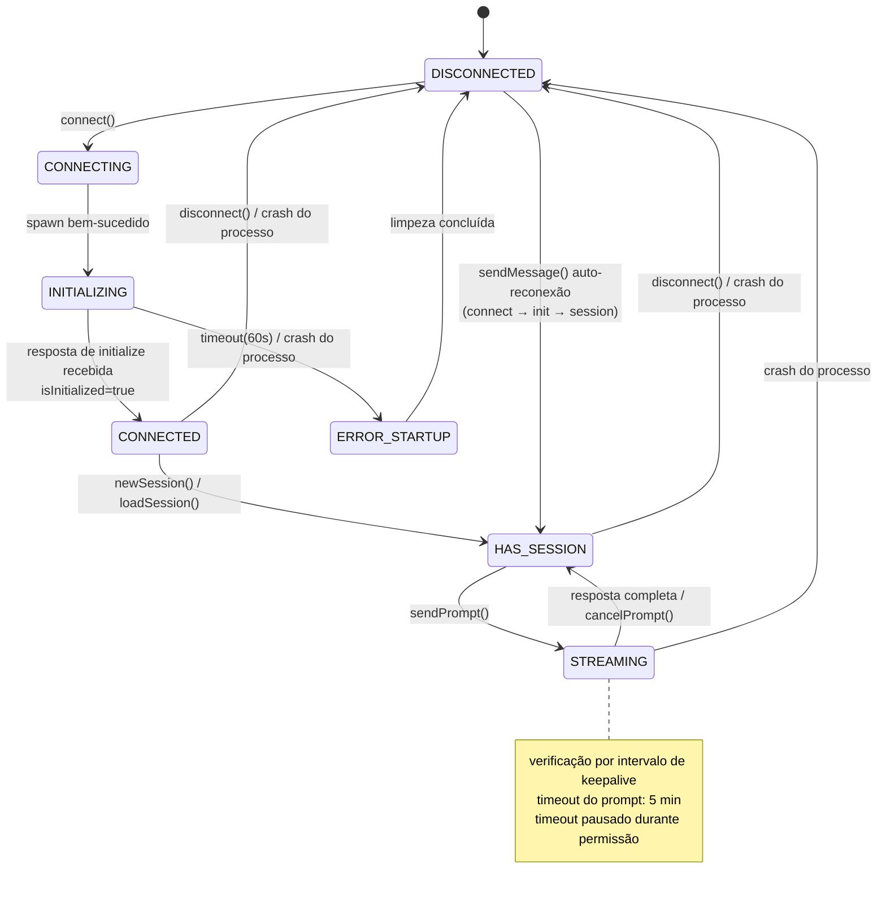
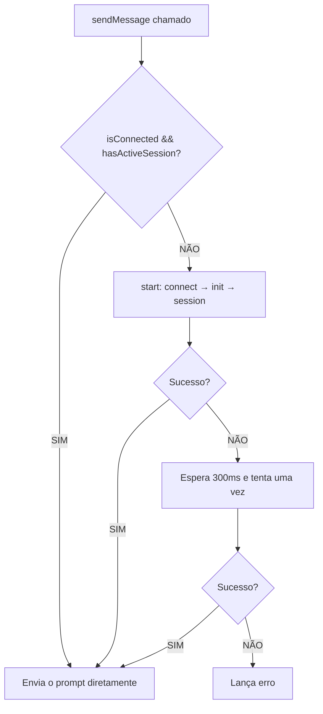
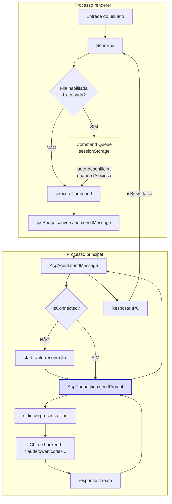

Esta página cobre dois mecanismos que, juntos, fazem uma conversa parecer responsiva mesmo enquanto a IA está ocupada:

- A **Command Queue** vive no **renderer** e bufferiza as mensagens do usuário no lado da UI.
- A **máquina de estados do ACP** vive no **processo principal** e gerencia a conexão com um agente de CLI de backend.

Elas são conectadas pelo IPC bridge — a fila observa o flag `isBusy` para decidir quando enviar a próxima mensagem.

## 1. Fila de Comandos da Conversa

### O que é e o que resolve

A Command Queue é um mecanismo de buffer de comandos controlável pelo usuário. Enquanto a IA está processando a mensagem anterior, as novas mensagens enviadas pelo usuário não são descartadas, mas entram em uma fila para serem executadas em ordem.

**O problema sem uma fila**: quando o usuário envia uma mensagem enquanto a IA está ocupada, ele vê apenas "conversation in progress" e a mensagem é perdida.

**Desativada por padrão**; precisa ser habilitada manualmente em Settings → System → "Enable Command Queue".

### Arquivos principais

| Arquivo                                                                    | Responsabilidade                                                           |
| -------------------------------------------------------------------------- | -------------------------------------------------------------------------- |
| `src/renderer/pages/conversation/platforms/useConversationCommandQueue.ts` | Hook principal, contém toda a lógica da fila                               |
| `src/renderer/components/chat/CommandQueuePanel.tsx`                        | Painel de UI da fila, suporta editar/arrastar/excluir                      |
| `src/renderer/hooks/mcp/messageQueue.ts`                                    | Fila de mensagens toast do MCP (mecanismo separado, não é a Command Queue) |

### Estruturas de dados e restrições

```typescript
type ConversationCommandQueueItem = {
  id: string; // UUID
  input: string; // texto do comando
  files: string[]; // caminhos dos anexos
  createdAt: number; // timestamp
};

type ConversationCommandQueueState = {
  items: ConversationCommandQueueItem[];
  isPaused: boolean; // o usuário pode pausar a execução automática
};
```

| Restrição                | Valor                             |
| ------------------------ | --------------------------------- |
| Tamanho máximo da fila   | 20 itens                          |
| Máx. de caracteres por item | 20.000                         |
| Máx. de anexos por item  | 50                                |
| Armazenamento máx. da fila | 256 KB                          |
| Persistência             | sessionStorage (por conversa)     |

### Condições de enfileiramento

```typescript
shouldEnqueueConversationCommand({ enabled, isBusy, hasPendingCommands }) = enabled && (isBusy || hasPendingCommands);
```

Ambas as condições precisam valer para enfileirar:

1. O toggle global está habilitado.
2. A IA está ocupada **ou** já existem comandos pendentes na fila.

### Posição no pipeline de mensagens



### Fluxo completo

**Fase de enfileiramento**

1. O usuário envia uma mensagem na SendBox.
2. `onSendHandler` verifica `shouldEnqueueConversationCommand()`.
3. Valida as restrições (entrada vazia, tamanho, contagem de arquivos, fila cheia, tamanho total).
4. Validação falha → prompt `Message.warning()`.
5. Validação passa → cria o item (UUID + timestamp), faz append na fila, persiste no sessionStorage.

**Fase de desenfileiramento (automática)**

1. Um `useEffect` observa: `[items, isBusy, enabled, isHydrated, isInteractionLocked]`.
2. Quando todas as condições valem:
   - A fila está habilitada.
   - O componente está hidratado (restauração do storage concluída).
   - Não está pausado.
   - A IA está ociosa (`isBusy = false`).
   - Não está com interação travada (o usuário não está editando/arrastando).
3. Pega o item do topo → define `waitingForTurnStart = true` → chama `onExecute()`.
4. A execução falha → restaura o item ao topo → pausa a fila automaticamente.

**Rastreio do turn**



### Suporte multiplataforma

O mecanismo de fila é integrado através da SendBox; as seguintes plataformas o suportam:

- Nanobot (`NanobotSendBox.tsx`)
- Gemini (`GeminiSendBox.tsx`)
- ACP (`AcpSendBox.tsx`)
- OpenClaw (`OpenClawSendBox.tsx`)
- Aionrs

## 2. Gestão de Estado do ACP

### Arquivos principais

| Arquivo                                     | Responsabilidade               |
| ------------------------------------------- | ------------------------------ |
| `src/process/agent/acp/AcpConnection.ts`    | Máquina de estados central     |
| `src/process/agent/acp/index.ts` (AcpAgent) | Wrapper de Agent da camada superior |
| `src/process/agent/acp/acpConnectors.ts`    | Lógica de spawn específica por backend |
| `src/common/types/acpTypes.ts`              | Definições de tipo             |

### Variáveis de estado

O ACP não usa um único enum para representar o estado; em vez disso, ele é determinado implicitamente pela **combinação de vários flags independentes**:

| Variável          | Tipo                   | Significado                                |
| ----------------- | ---------------------- | ------------------------------------------ |
| `child`           | `ChildProcess \| null` | Referência ao processo filho               |
| `sessionId`       | `string \| null`       | ID da session ativa                        |
| `isInitialized`   | `boolean`              | Se o handshake de protocolo está completo  |
| `isSetupComplete` | `boolean`              | Se a fase de inicialização está completa   |
| `backend`         | `AcpBackend \| null`   | Tipo de backend                            |
| `pendingRequests` | `Map`                  | Requisições RPC em andamento               |

Propriedades derivadas:

```typescript
get isConnected(): boolean {
  return this.child !== null && !this.child.killed;
}
get hasActiveSession(): boolean {
  return this.sessionId !== null;
}
```

### Estados lógicos

| Estado            | Combinação de condições                                    | Significado                        |
| ----------------- | ---------------------------------------------------------- | ---------------------------------- |
| **DISCONNECTED**  | child=null, sessionId=null, isInitialized=false            | Sem processo, sem session          |
| **CONNECTING**    | child≠null, isInitialized=false                            | Processo iniciando                 |
| **INITIALIZING**  | child rodando, requisição initialize em andamento          | Handshake de protocolo (timeout 60s) |
| **CONNECTED**     | isConnected=true, isInitialized=true, isSetupComplete=true | Pronto, aguardando criar uma session |
| **HAS_SESSION**   | CONNECTED + sessionId≠null                                 | Pode enviar mensagens              |
| **STREAMING**     | HAS_SESSION + pendingRequests.size>0                       | Turn em andamento                  |
| **ERROR_STARTUP** | child saiu, isSetupComplete=false                          | Quebrou durante a inicialização    |
| **ERROR_RUNTIME** | child saiu, isSetupComplete=true                           | Quebrou em tempo de execução       |

### Diagrama de transição de estados



### Métodos principais

| Método                        | Responsabilidade                |
| ----------------------------- | ------------------------------- |
| `connect()`                   | Inicia a conexão                |
| `doConnect()`                 | Despacha o spawn por backend    |
| `setupChildProcessHandlers()` | Configura os handlers de protocolo |
| `initialize()`                | Envia o RPC de initialize       |
| `newSession()`                | Cria uma nova session           |
| `loadSession()`               | Restaura uma session existente  |
| `sendPrompt()`                | Envia uma mensagem do usuário   |
| `handleMessage()`             | Recebe respostas                |
| `handleProcessExit()`         | Limpa ao sair do processo       |
| `disconnect()`                | Desconexão iniciada pelo usuário |
| `cancelPrompt()`              | Cancela o turn atual            |

### Pontos de atenção de estabilidade conhecidos

Estes são pontos delicados que vale conhecer ao trabalhar em `AcpConnection.ts` / `index.ts`:

1. **Sem proteção contra prompt concorrente** — `sendPrompt()` não tem guard de reentrância. Se chamado novamente antes de o prompt anterior terminar, duas requisições são enviadas no mesmo stdin do processo e o comportamento da camada de protocolo é indefinido. Hoje depende de a camada de UI não chamar duas vezes seguidas.
2. **Race de timeout de permissão** — quando uma requisição de permissão bloqueia o prompt, o timeout é pausado. Mas se o diálogo ficar sem resposta por muito tempo, um timeout espúrio pode disparar depois que ele é retomado.
3. **Timing de detecção do estado do processo** — há uma pequena lacuna entre o evento `exit` do Node.js e a definição das propriedades `exitCode`/`signalCode`, então o keepalive pode ler um estado obsoleto.
4. **Sobrescrita de requisição de permissão duplicada** — se o agente envia duas requisições de permissão para o mesmo `toolCallId`, a segunda sobrescreve a entrada pendente da primeira, perdendo o callback de resolve da primeira.
5. **Fallback frágil de session ID** — `this.sessionId = response.sessionId || sessionId;` recorre ao id passado quando o backend retorna um `sessionId` indefinido, mas lança exceção se a própria resposta for null/undefined.
6. **Setters não validam o estado da conexão** — `setSessionMode()`, `setModel()`, `setConfigOption()` só verificam se `sessionId` existe, não se o processo está vivo, então podem escrever em um processo já morto.
7. **Inconsistência de cache duplo do model** — `setModel()` atualiza tanto o cache `this.models` quanto `this.configOptions`; se uma atualização falhar, os dois divergem.

### Reconexão automática

Quando `sendMessage()` encontra `!isConnected || !hasActiveSession`, ele chama automaticamente `start()` para rodar a sequência completa connect → initialize → newSession/loadSession. Após a primeira falha há uma nova tentativa com 300ms de atraso.



## 3. Como os dois se encaixam



A Command Queue vive na **camada de UI do processo renderer** e bufferiza os comandos no lado do usuário; a máquina de estados do ACP vive no **processo principal** e gerencia a conexão e a comunicação de protocolo com a CLI de backend. Os dois são conectados pelo IPC bridge, e a fila decide quando desenfileirar e executar o próximo comando observando o estado `isBusy`.
